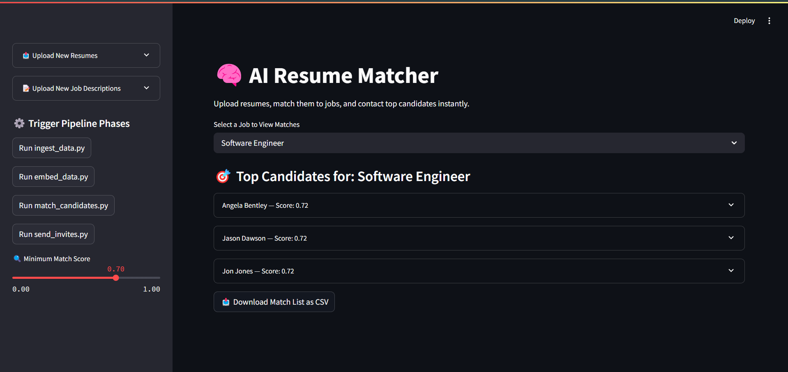

# Automated Recruitment System



## Overview

The **Automated Recruitment System** leverages artificial intelligence to streamline and optimize the entire recruitment workflow. From parsing resumes to scheduling interviews, our system reduces human error, increases operational efficiency, and dramatically improves candidate matching accuracy.

## 🎬 Demo

See the Automated Recruitment System in action:
[Watch Demo Video](https://www.youtube.com/watch?v=YPTta5zi6nM)

## 📊 Presentation

For a comprehensive overview of the system architecture, features, and benefits:
[View Presentation](https://docs.google.com/presentation/d/14YcSTTayUYbQEn-j36TBZ2xKBY4WxfpS/edit)

## ✨ Key Features

- **Intelligent Resume Parsing:** Automatically extracts and categorizes relevant information from candidate resumes
- **Semantic Job Description Processing:** Creates embeddings for job descriptions enabling powerful matching capabilities
- **AI-Powered Candidate Matching:** Uses semantic similarity algorithms to match the best candidates to each position
- **Automated Communication:** Sends personalized email invitations to shortlisted candidates without manual intervention
- **Smart Interview Scheduling:** Automatically schedules interviews and sends calendar invites based on availability

## 🛠️ Technologies Used

- **Ollama:** On-premises LLM for generating text embeddings and performing semantic matching
- **SQLite:** Lightweight database for storing all recruitment data
- **Python:** Core programming language for system logic and data processing
- **Streamlit:** Interactive user dashboard for recruitment management
- **SMTP:** Protocol for automated email communications
- **LangChain:** Framework for orchestrating multiple AI agents

## 📁 Project Structure

```
ai_recruitment_system/
├── agents/                      # AI agents for different recruitment tasks
│   ├── summarizer_agent.py      # Summarizes job descriptions
│   ├── matching_agent.py        # Matches candidates to job descriptions
│   └── email_agent.py           # Sends emails to shortlisted candidates
├── data/                        # Data storage
│   ├── resumes/                 # Candidate resumes
│   └── job_descriptions/        # Open role descriptions
├── db/                          # Database files
│   ├── database.sqlite          # Main database
│   └── setup_db.py              # Database initialization script
├── models/                      # AI models
│   └── embedding_model.py       # Embedding generation for matching
├── tools/                       # Utility tools
│   └── email_tool.py            # Email automation tool
├── config.yaml                  # System configuration
├── app.py                       # Application entry point
├── requirements.txt             # Dependencies
└── README.md                    # Documentation
```

## 🚀 Installation

1. Clone the repository:
   ```bash
   git clone https://github.com/yourusername/ai-recruitment-system.git
   cd ai-recruitment-system
   ```

2. Install required dependencies:
   ```bash
   pip install -r requirements.txt
   ```

3. Set up the database:
   ```bash
   python db/setup_db.py
   ```

4. Start the application:
   ```bash
   python app.py
   ```

5. Access the dashboard:
   ```
   http://localhost:8501
   ```

## 📋 Usage Guide

1. **Upload Job Description:** Add new job openings via CSV or text file
2. **Upload Resumes:** Import candidate resumes in PDF format
3. **Review Matches:** Examine AI-ranked candidates based on job fit
4. **Send Invitations:** Automatically dispatch personalized interview requests
5. **Manage Scheduling:** Track and organize interview schedules

## 💡 Example Workflow

1. **Job Description Upload:** HR uploads details for a Senior Developer position
2. **Resume Processing:** System ingests and analyzes 50+ candidate resumes
3. **AI Matching:** Candidates are ranked by relevance to position requirements
4. **Automated Outreach:** Top 10 candidates automatically receive personalized invitations
5. **Scheduling:** Interviews are scheduled based on calendar availability

## 🤝 Contributing

Contributions are welcome! Please follow these steps:

1. Fork the repository
2. Create a feature branch: `git checkout -b new-feature`
3. Commit your changes: `git commit -am 'Add new feature'`
4. Push to the branch: `git push origin new-feature`
5. Submit a pull request

## 📜 License

This project is licensed under the MIT License - see the LICENSE file for details.

## 📬 Contact

For questions or support, please contact: jadhavoj2018@gmail.com

---

### Happy Hiring! 🚀
